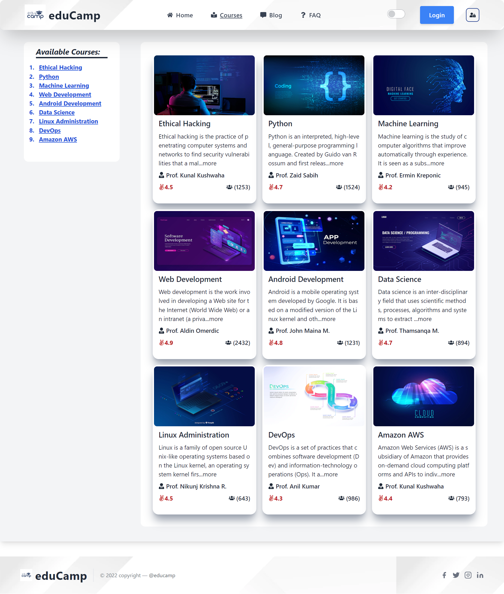
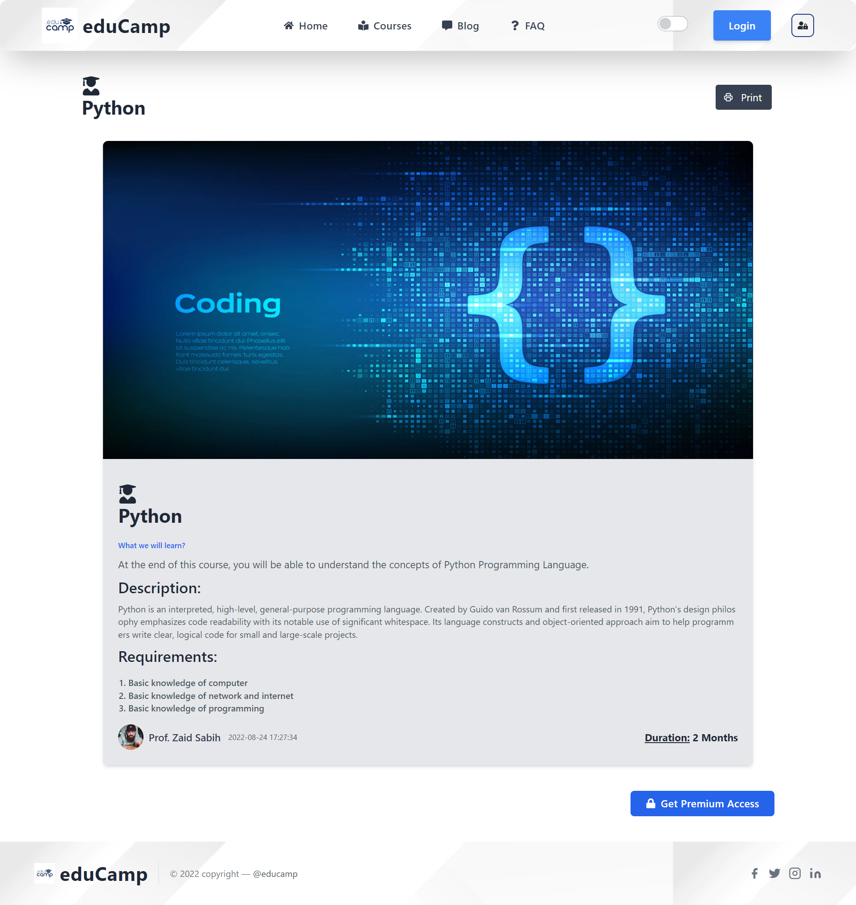
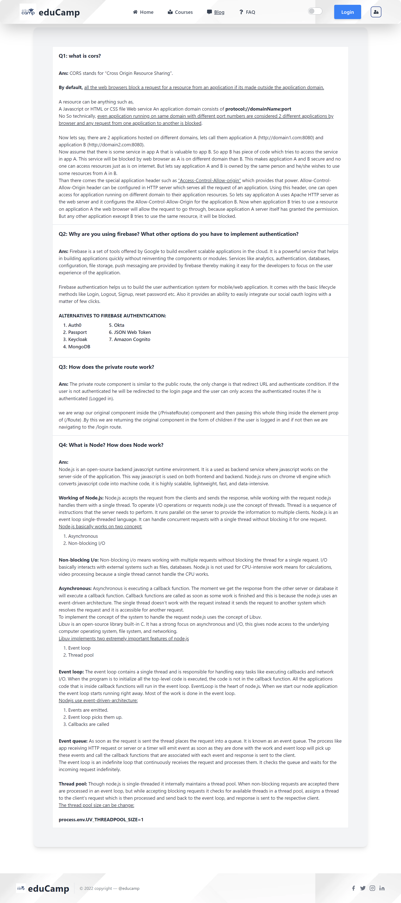
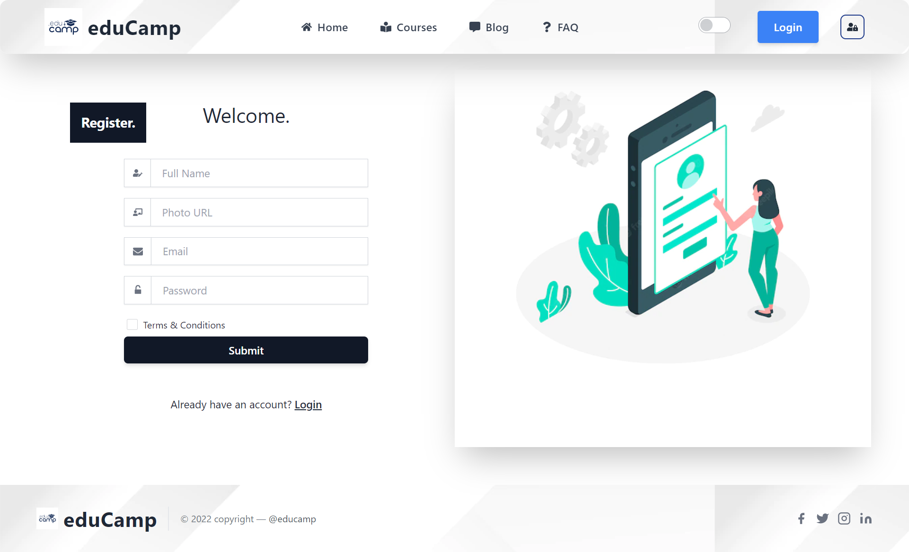
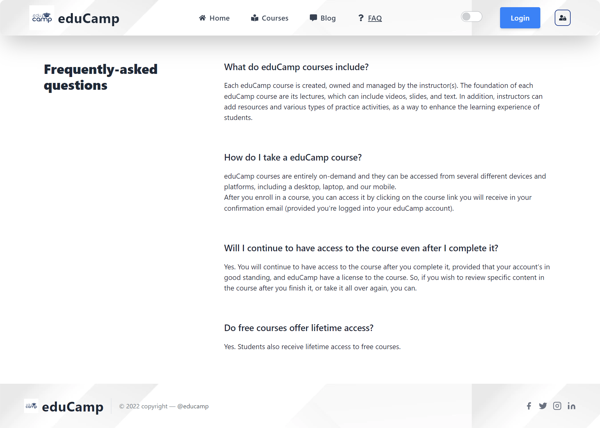
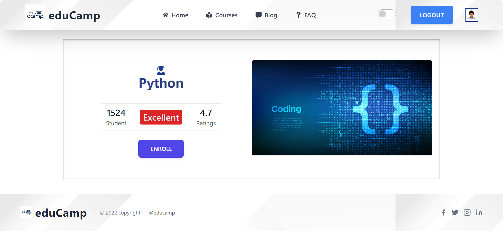

# EduCamp (ReactJS)

1. Live Website: https://reactjs-edu-camp-auth-app.web.app/
2. Server Site: https://server-edu-camp-reactjs.vercel.app/

## Description:

1. A web base application (ReactJs).
2. Users can visit the "Courses" page for find Available Courses.
3. On Selecting the specific course system will redirect to the "Course Details" Page.
4. At the "Course Details" Page user can Download the full Course Details as PDF Format.
5. By Selecting the "Get Premium Access" system will redirect the user to the Enrollment Page if the user is already Loged in, Other wise system will re direct the user to the "Login" Page.
6. If the user is not registered, then user can go to the "Registration" page by clicking "signup" for registration.
7. By clicking "Profile" icon user can view the profile details if the user is Loged in.
8. System is Fully Authenticate By "Google Firebase Authentication".
9. There are also "Blog" and "FAQ" page. From there user can find related Questions about the website.
10. System is fully responsive.
11. All Data's are created and hosted on "vercel".
#

## Technology Uses (Frameworks, libraries):

##### Frameworks:
1. Tailwind CSS.
2. react-router-dom

##### Libraries:
1. React JS
2. Daisy UI
3. react-hot-toast
4. react-icons
5. react-spinners
6. react-to-pdf
7. sweetalert2
#
## Deploy:
1. Vercel (Server Side)
2. Firebase (Client Side)
#

## App Demo:

### 1. Home Page:
##

##
### 2. Courses:
##

##
### 3. Course Details:
##

##
### 4. Blog:
##

##
### 5. Register:
##

##
### 6. Login:
##

##
### 7. Frequently Ask Question(FAQ):
##

##
### 8. Enrollment (Premium Access):
##

##
